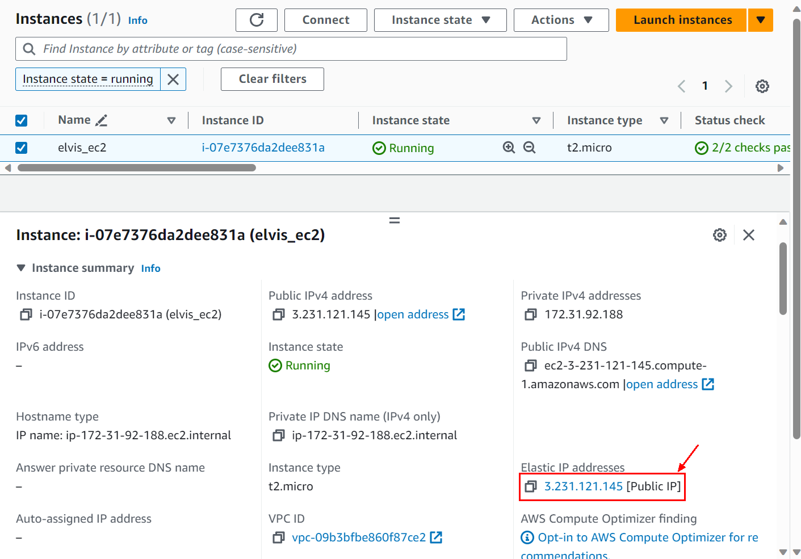
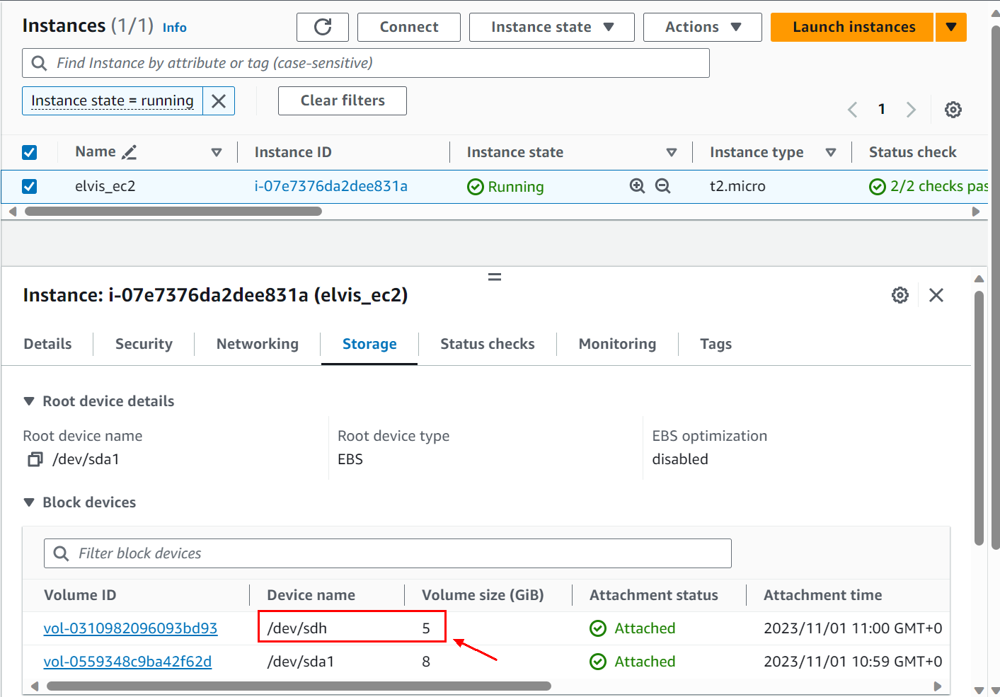

# Terraform-MiniProject
MiniTerraform : Streamlined Deployment

# Mini-Projet Terraform : Déploiement d&#39;une Infrastructure Complète

Ce projet a pour objectif de déployer une infrastructure cloud complète en utilisant Terraform. Il
comprend la création d&#39;une instance EC2, d&#39;un volume EBS, d&#39;une adresse IP publique, et d&#39;un groupe
de sécurité. De plus, Nginx sera installé sur l&#39;instance EC2, et l&#39;adresse IP publique sera enregistrée
dans un fichier nommé `ip_ec2.txt`.

## Modules Terraform

Le projet est organisé en utilisant plusieurs modules Terraform, chacun ayant un rôle spécifique :

1. **EC2 Instance Module**: Crée une instance EC2 en utilisant la dernière version d&#39;Ubuntu,
en attachant un volume EBS et une adresse IP publique. La taille de l&#39;instance et les tags sont
paramétrables.

2. **EBS Volume Module**: Crée un volume EBS avec une taille configurable.

3. **Public IP Module**: Génère une adresse IP publique et l&#39;associe au groupe de sécurité.

4. **Security Group Module**: Crée un groupe de sécurité permettant les connexions sur les ports
80 et 443.

## Structure du Projet

Le projet est organisé de la manière suivante :

- Le dossier `app` utilise les modules ci-dessus pour déployer une instance EC2. Les variables sont
configurées pour rendre l&#39;application dynamique.

- À la fin du déploiement, Nginx est installé sur l&#39;instance EC2.

- L&#39;adresse IP publique de l&#39;instance EC2 est enregistrée dans un fichier `ip_ec2.txt`.

## Instructions d&#39;Utilisation

Pour déployer l&#39;infrastructure, suivez ces étapes :

1. Clônez ce dépôt GitHub.

2. Naviguez dans le dossier `app`.

3. Exécutez `terraform init` pour initialiser Terraform.

4. Exécutez `terraform apply` pour créer l&#39;infrastructure.

5. Après le déploiement, vous trouverez l&#39;adresse IP publique dans le fichier `ip_ec2.txt`.

## Captures d'écran

Voici quelques captures d'écran pour illustrer le succès du déploiement de l'infrastructure

#### 1. EC2 avec Elastic IP associé.

L'instance EC2 a été créée et l'elastic IP associé avec succès

#### 2. Vérification de NGINX déployé.

Notre serveur est ainsi joingnable via l'ip public.

#### 3. EC2 avec Elastic IP associé.

L'instance EC2 a été créée et l'ebs associé avec succès

#### 4. Vérification des security groups.

Les règles inbound

Les règles outbound

## Auteur

Méwé Elvis BALO

Mail: elvisbalo9@gmail.com